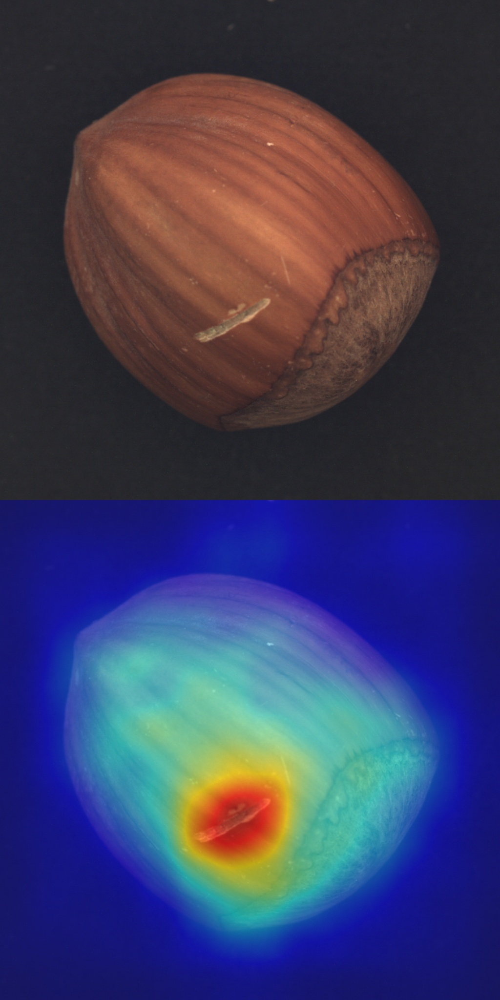

<div align="center">
  
  
-----------------------------------------------------------
  
</div>

<div align="center">
  
  
  
  
  
  
-----------------------------------------------------------
</div>

English | [简体中文](README_zh-CN.md)

## Introduction

DeepHawkeye is a library to detect unusual patterns in images using features from pretrained neural networks

Reference [PatchCore](https://arxiv.org/abs/2106.08265) anomaly detection model


<details open>
<summary>Major features</summary>

- **Using nominal (non-defective) example images only**

- **Faiss(CPU/GPU)**

- **TensorRT Deployment**
</details>

## Installation
```bash
$ git clone https://github.com/tbcvContributor/DeepHawkeye.git
$ pip install opencv-python
$ pip install scipy

# pytorch
$ pip install torch==1.8.0+cu111 torchvision==0.9.0+cu111 torchaudio==0.8.0 -f https://download.pytorch.org/whl/torch_stable.html


#install faiss
# CPU-only version（currently available on Linux, OSX, and Windows）
$ conda install -c pytorch faiss-cpu
# GPU(+CPU) version （containing both CPU and GPU indices, is available on Linux systems）
$ conda install -c pytorch faiss-gpu
# or for a specific CUDA version
$ conda install -c pytorch faiss-gpu cudatoolkit=10.2 # for CUDA 10.2 
```
## Checkpoints and Demo data
Wide ResNet-50-2 and demo data

[[Google]](https://drive.google.com/drive/folders/1IhbGLTlCuqwoXP7tqILdvu_mOwqh66SD?usp=sharing)

[[Baidu],code:a14e](https://pan.baidu.com/s/1_3yslTtUC6tIe_VRxehgAQ)
```
${ROOT}
   └——————weights
           └——————wide_r50_2.pth
   └——————demo_data
           └——————grid
                    └——————normal_data
                    └——————test_data
           └——————....
```
## Demo

```
bulid normal lib
python demo_train.py -d ./demo_data/grid/normal_data -c grid
pytorch infer
python demo_test.py -d ./demo_data/grid/test_data -c grid
tensorrt infer
python demo_trt.py -d ./demo_data/grid/test_data -c grid -t ./weights/w_res_50.trt
```

## Tutorials

* Need normal example images  to cover all scenarios as much as possible


* [Faiss Documentation](https://github.com/facebookresearch/faiss/wiki) Default IVFXX, PQ16

<details open>
<summary>train args</summary>

```
def get_train_args():
    parser = argparse.ArgumentParser()
    parser.add_argument('-d','--total_img_paths',type=str, default=None)
    parser.add_argument('-c','--category',type=str, default=None)
    parser.add_argument('--batch_size', default=64)
    parser.add_argument('--embedding_layers',choices=['1_2', '2_3'], default='2_3')
    parser.add_argument('--input_size', default=(224, 224))
    parser.add_argument('--weight_path', default='./weights/wide_r50_2.pth')
    parser.add_argument('--normal_feature_save_path', default=f"./index_lib")
    parser.add_argument('--model_device', default="cuda:0")
    parser.add_argument('--max_cluster_image_num', default=1000,help='depend on CPU memory, more than total images number')
    parser.add_argument('--index_build_device', default=-1,help='CPU:-1 ,GPU number eg: 0, 1, 2 (only on Linux)')

```
tips：

--input_size: trade off between speed and accuracy of the result
--max_cluster_image_num：If RAM allows, greater than or equal to the total number of samples 
</details>

<details open>
<summary>test args</summary>

```
def get_test_args():
    parser = argparse.ArgumentParser()
    parser.add_argument('-d', '--test_path', type=str, default=None)
    parser.add_argument('-c', '--category', type=str, default=None)
    parser.add_argument('--model_device', default="cuda:0")
    parser.add_argument('--test_batch_size', default=64)
    parser.add_argument('--embedding_layers', choices=['1_2', '2_3'], default='2_3')
    parser.add_argument('--input_size', default=(224, 224))
    parser.add_argument('--test_GPU', default=-1, help='CPU:-1,'
                                                       'GPU: num eg: 0, 1, 2'
                                                       'multi_GPUs:[0,1,...]')
    parser.add_argument('--save_heat_map_image', default=True)
    parser.add_argument('--heatmap_save_path',
                        default=fr'./results', help='heatmap save path')
    parser.add_argument('--threshold', default=2)
    parser.add_argument('--nprobe', default=10)
    parser.add_argument('--n_neighbors', type=int, default=5)
    parser.add_argument('--weight_path', default='./weights/wide_r50_2.pth')
    parser.add_argument('--normal_feature_save_path', default=f"./index_lib")
```
tips：

--threshold: depend on scores of anomaly data 

result format：{filename}_{score}.jpg

</details>

* [TensorRT Deployment](trt_tools/Tensorrt_deployment.md)
## License

This project is released under the [Apache 2.0 license](LICENSE).

## Code Reference
https://github.com/hcw-00/PatchCore_anomaly_detection
embedding concat function :
https://github.com/xiahaifeng1995/PaDiM-Anomaly-Detection-Localization-master
