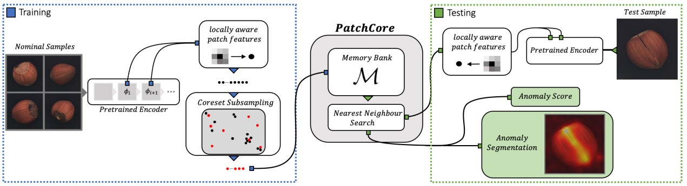

<div align="center">
  
  
-----------------------------------------------------------
  
</div>

<div align="center">
  
  
  
  
  
  
  
  -----------------------------------------------------------
  
</div>

[English](README.md) | 简体中文

## 简介
DeepHawkeye 是一个通过预训练神经网络来检测图像异常模式的库

参考自[PatchCore](https://arxiv.org/abs/2106.08265)


<details open>
<summary>主要特性</summary>

- **仅需正样本**

- **Faiss(CPU/GPU)**

- **TensorRT部署**
</details>

## 安装
```bash
$ git clone https://github.com/tbcvContributor/DeepHawkeye.git
$ cd DeepHawkeye
$ pip install -r requirements.txt

#安装faiss
# CPU-only version（currently available on Linux, OSX, and Windows）
$ conda install -c pytorch faiss-cpu
# GPU(+CPU) version （containing both CPU and GPU indices, is available on Linux systems）
$ conda install -c pytorch faiss-gpu
# or for a specific CUDA version
$ conda install -c pytorch faiss-gpu cudatoolkit=10.2 # for CUDA 10.2 
```

## 模型权重和demo数据
Wide ResNet-50-2 and demo data

[[Google]](https://drive.google.com/drive/folders/1IhbGLTlCuqwoXP7tqILdvu_mOwqh66SD?usp=sharing)

[[Baidu],code:a14e](https://pan.baidu.com/s/1_3yslTtUC6tIe_VRxehgAQ)
```
${ROOT}
   └——————weights
           └——————wide_r50_2.pth
   └——————demo_data
           └——————grid
                    └——————normal_data
                    └——————test_data
           └——————....
```
## Demo

```
建正样本库
python demo_train.py -d ./demo_data/grid/normal_data -c grid
使用pytorch测试
python demo_test.py -d ./demo_data/grid/test_data -c grid
使用tensorrt测试
python demo_trt.py -d ./demo_data/grid/test_data -c grid -t ./weights/w_res_50.trt
```
## Tutorials

* 需要正样本尽可能覆盖所有场景

* [Faiss使用指南](https://github.com/facebookresearch/faiss/wiki) 默认使用IVFXX,PQ16

<details open>
<summary>训练参数设置</summary>

```
def get_train_args():
    parser = argparse.ArgumentParser()
    parser.add_argument('-d','--total_img_paths',type=str, default=None)
    parser.add_argument('-c','--category',type=str, default=None)
    parser.add_argument('--batch_size', default=64)
    parser.add_argument('--embedding_layers',choices=['1_2', '2_3'], default='2_3')
    parser.add_argument('--input_size', default=(224, 224))
    parser.add_argument('--weight_path', default='./weights/wide_r50_2.pth')
    parser.add_argument('--normal_feature_save_path', default=f"./index_lib")
    parser.add_argument('--model_device', default="cuda:0")
    parser.add_argument('--max_cluster_image_num', default=1000,help='depend on CPU memory, more than total images number')
    parser.add_argument('--index_build_device', default=-1,help='CPU:-1 ,GPU number eg: 0, 1, 2 (only on Linux)')

```
tips：

--input_size: 图片尺寸越大效果越好，但计算量也会随之增加。

--max_cluster_image_num：在内存允许的情况下，大于等于总样本个数
</details>

<details open>
<summary>测试参数设置</summary>

```
def get_test_args():
    parser = argparse.ArgumentParser()
    parser.add_argument('-d', '--test_path', type=str, default=None)
    parser.add_argument('-c', '--category', type=str, default=None)
    parser.add_argument('--model_device', default="cuda:0")
    parser.add_argument('--test_batch_size', default=64)
    parser.add_argument('--embedding_layers', choices=['1_2', '2_3'], default='2_3')
    parser.add_argument('--input_size', default=(224, 224))
    parser.add_argument('--test_GPU', default=-1, help='CPU:-1,'
                                                       'GPU: num eg: 0, 1, 2'
                                                       'multi_GPUs:[0,1,...]')
    parser.add_argument('--save_heat_map_image', default=True)
    parser.add_argument('--heatmap_save_path',
                        default=fr'./results', help='heatmap save path')
    parser.add_argument('--threshold', default=2)
    parser.add_argument('--nprobe', default=10)
    parser.add_argument('--n_neighbors', type=int, default=5)
    parser.add_argument('--weight_path', default='./weights/wide_r50_2.pth')
    parser.add_argument('--normal_feature_save_path', default=f"./index_lib")
```
tips：

--threshold: 需要根据异常数据的分数确定

保存结果形式：{filename}_{score}.jpg

</details>

* [TensorRT部署](trt_tools/Tensorrt_deployment.md)


## 开源许可证

该项目采用 [Apache 2.0 开源许可证](LICENSE)

##Code Reference

https://github.com/hcw-00/PatchCore_anomaly_detection

embedding concat function :
https://github.com/xiahaifeng1995/PaDiM-Anomaly-Detection-Localization-master


